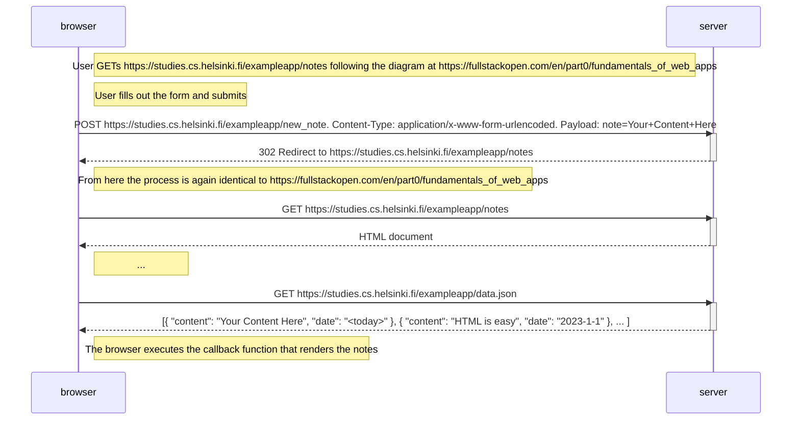

```mermaid
sequenceDiagram
    participant browser
    participant server

    Note right of browser: User GETs https://studies.cs.helsinki.fi/exampleapp/notes following the diagram at https://fullstackopen.com/en/part0/fundamentals_of_web_apps#loading-a-page-containing-java-script-review
    Note right of browser: User fills out the form and submits
    browser->>server: POST https://studies.cs.helsinki.fi/exampleapp/new_note. Content-Type: application/x-www-form-urlencoded. Payload: note=Your+Content+Here # TODO: break this into multiple lines
    activate server
    server-->>browser: 302 Redirect to https://studies.cs.helsinki.fi/exampleapp/notes
    deactivate server

    Note right of browser: From here the process is again identical to https://fullstackopen.com/en/part0/fundamentals_of_web_apps#loading-a-page-containing-java-script-review

    browser->>server: GET https://studies.cs.helsinki.fi/exampleapp/notes
    activate server
    server-->>browser: HTML document
    deactivate server

    Note right of browser: ...

    browser->>server: GET https://studies.cs.helsinki.fi/exampleapp/data.json
    activate server
    server-->>browser: [{ "content": "Your Content Here", "date": "<today>" }, { "content": "HTML is easy", "date": "2023-1-1" }, ... ]
    deactivate server

    Note right of browser: The browser executes the callback function that renders the notes
```
