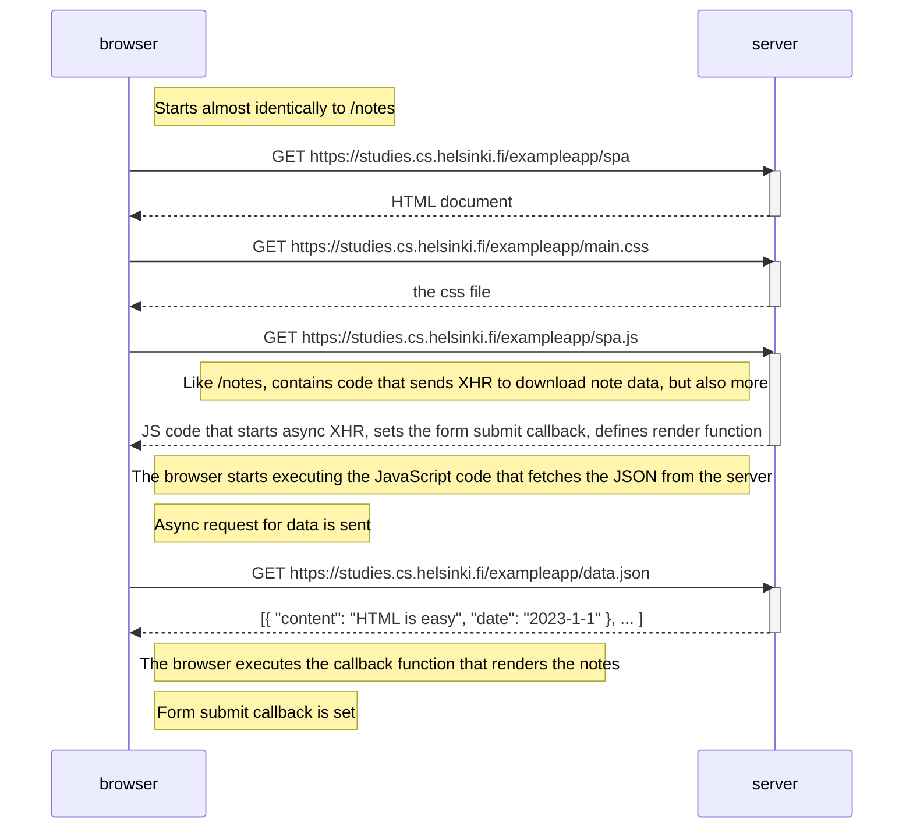

```mermaid
sequenceDiagram
    participant browser
    participant server

    Note right of browser: Starts almost identically to /notes

    browser->>server: GET https://studies.cs.helsinki.fi/exampleapp/spa
    activate server
    server-->>browser: HTML document
    deactivate server

    browser->>server: GET https://studies.cs.helsinki.fi/exampleapp/main.css
    activate server
    server-->>browser: the css file
    deactivate server

    browser->>server: GET https://studies.cs.helsinki.fi/exampleapp/spa.js
    activate server
    Note left of server: Like /notes, contains code that sends XHR to download note data, but also more
    server-->>browser:  JS code that starts async XHR, sets the form submit callback, defines render function
    deactivate server

    Note right of browser: The browser starts executing the JavaScript code that fetches the JSON from the server
    Note right of browser: Async request for data is sent

    browser->>server: GET https://studies.cs.helsinki.fi/exampleapp/data.json
    activate server
    server-->>browser: [{ "content": "HTML is easy", "date": "2023-1-1" }, ... ]
    deactivate server

    Note right of browser: The browser executes the callback function that renders the notes
    Note right of browser: Form submit callback is set
```