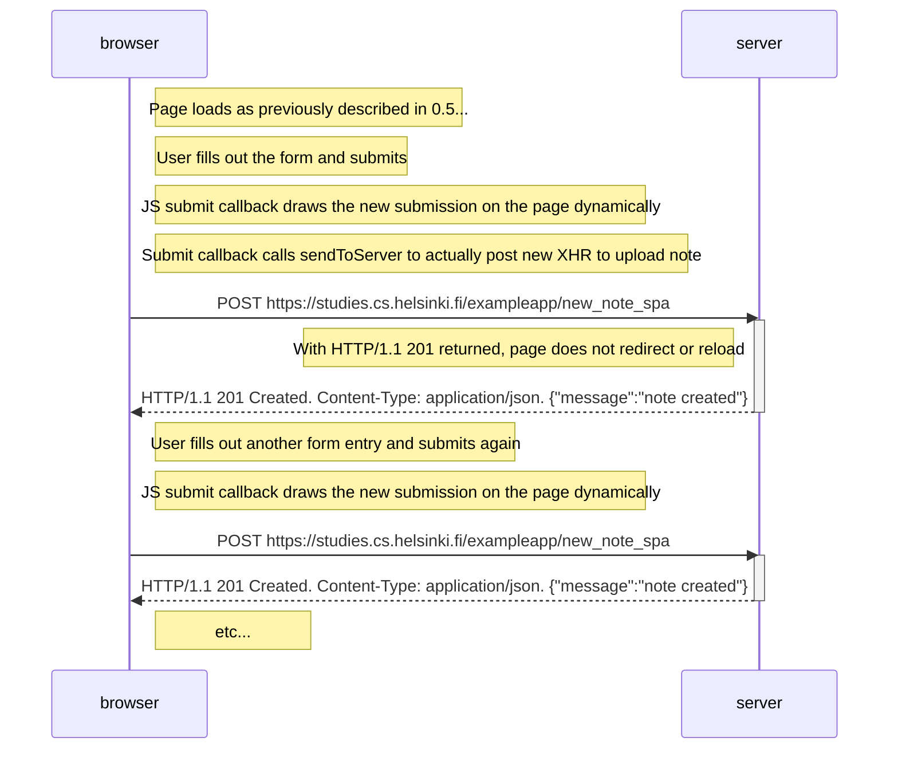

```mermaid
sequenceDiagram
    participant browser
    participant server

    Note right of browser: Page loads as previously described in 0.5...

    Note right of browser: User fills out the form and submits
    Note right of browser: JS submit callback draws the new submission on the page dynamically
    Note right of browser: Submit callback calls sendToServer to actually post new XHR to upload note
    browser->>server: POST https://studies.cs.helsinki.fi/exampleapp/new_note_spa
    activate server
    Note left of server: With HTTP/1.1 201 returned, page does not redirect or reload
    server-->>browser: HTTP/1.1 201 Created. Content-Type: application/json. {"message":"note created"}
    deactivate server

    Note right of browser: User fills out another form entry and submits again
    Note right of browser: JS submit callback draws the new submission on the page dynamically
    browser->>server: POST https://studies.cs.helsinki.fi/exampleapp/new_note_spa
    activate server
    server-->>browser: HTTP/1.1 201 Created. Content-Type: application/json. {"message":"note created"}
    deactivate server

    Note right of browser: etc...
```